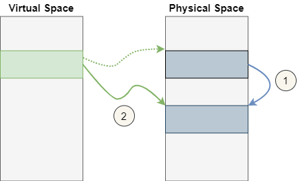
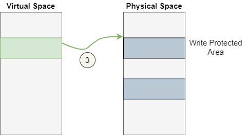
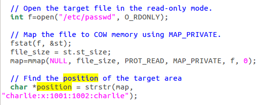
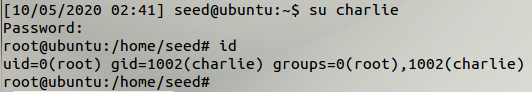

# Dirty-Cow-Attack

## Overview
- The Dirty COW vulnerability is an interesting case of the race condition vulnerability. It existed in the Linux kernel since September 2007, and was discovered and exploited in October 2016. The vulnerability affects all Linux-based operating systems, including Android, and its consequence is very severe: attackers can gain the root privilege by exploiting the vulnerability.
- The vulnerability resides in the code of **copy-on-write (COW)** inside Linux kernel. By exploiting this vulnerability, attackers can modify any protected file, even though these files are only readable to them.

## Explanation
- `mmap()` allows mapping a file on the disk to the memory. Once the file is mapped to the memory, the reading and writing to the file is similar to the files in the memory. But this is possible only if the file was write access to the user.
- Once the file is mapped, it can be read via the mapped memory and can be written to using `memcpy()` 
- On closing the file, the content is stored to the disk.
- But if the file has only read access and not write access, the new content is written to a private copy of the file in the memory and the original write protected file will not be modified at the end.
- In this scenario, when the mapping completes, and the user tries to modify the file via mapped memory, it does not allow the operation because the memory address is read-only. So, the kernel creates another block of memory which is the copy of the earlier block. Then, the kernel permits write operation to this copy.
- The address space is a virtual table. On mapping, the file is mapped from the virtual space to the physical space. When the kernel makes a copy, it does not do this from virtual space to virtual space, rather from physical space to physical space. This is how the process ends up writing to the copy and not the original file.
- The picture here shows how the virtual space is first mapped to the physical space which gets copied to another physical space and on write operation, the virtual space points to the new copied version of physical space.



- The write does 2 operations: First, it copies the content from original physical space to the new physical space; and then, the actual write operation takes place. Because operation 1 and 2 as shown in the above picture are not atomic, the write operation can be interrupted in the middle.
- There is another system call called `madvise()`. This function deletes the private copy and changes the direction to the original section.The option in this function, `MADV_DONTNEED` tells the system that the private copy is not needed anymore and control can be shifted to the original copy.



- On summary, Operation 1 changes mapping to the private copy; Operation 2 writes to the memory; and Operation 3 changes the mapping back to the original space.
- Normally, operation occurs in the sequence of 1, 2 and then 3 which is the ideal case. But because operation 1 and 2 are not atomic, operation 3 can be proceeded between 1 and 2 such that the operation occurs in the sequence of 1,3 and 2.
- Under this situation, During operation 1, the protection of the file is checked and a new copy is created. At this time if operation 3 occurs, it shifts the mapping back to the original space. And after that if operation 2 occurs it would write to the original space which is write protected. This will be allowed because the checking has already been completed during the first operation so while writing no further checking will be required.
- This is all possible because copying takes time and meanwhile operation 3 can be executed.

## Task 1: Modify a Dummy Read-Only File

### Create a Dummy File
- This task requires creating a dummy file under root privilege such that the file is read only to the other non-root users. 
- The following commands can be used to create the dummy file which is writable to only root.
```
$ sudo touch /zzz 
$ sudo chmod 644 /zzz 
$ sudo gedit /zzz 
$ cat /zzz 
111111222222333333 
$ ls -l /zzz 
-rw-r--r-- 1 root root 19 Oct 18 22:03 /zzz 
$ echo 99999 > /zzz 
bash: /zzz: Permission denied
```

### Set Up the Memory Mapping Thread
- [cow_attack.c](cow_attack.c) is a C code that has 3 threads: `main`, `write` and `madvise`.
- The main thread maps /zzz to memory, finds where the pattern "222222" is, and then creates two threads to exploit the Dirty COW race condition vulnerability in the OS kernel.
- Using mmap, the virtual memory is mapped to the physical space which will hold the file, /zzz. Since the file is only read permitted, `PRPT_READ` operation is implemented and there is no `PROT_WRITE` because the file does not have write permission.
- `strstr()` function is used to find where "222222" is in the mapped memory.
- Then, the two remaining threads are run.

### Set Up the write Thread
- The job of the write thread listed is to replace the string "222222" in the memory with "******". 
- The content that needs to be modified is stored in the pointer content
- `/proc/self/mem` is the memory location where the mapping has occurred.
- Then, the pointer is moved to where the line that needs to be edited resides, using `lseek()`.
- And finally the content is written there.
- Since the mapped memory is of COW type, this thread alone will only be able to modify the contents in a copy of the mapped memory, which will not cause any change to the underlying /zzz file. 

### The madvise Thread
- The madvise thread discards the private copy of the mapped memory, so the page table can point back to the original mapped memory.

### Launch the Attack
- If the `write()` and the `madvise()` system calls are invoked alternatively, i.e., one is invoked only after the other is finished, the write operation will always be performed on the private copy, and we will never be able to modify the target file.
- The only way for the attack to succeed is to perform the madvise() system call while the write() system call is still running.
- To achieve the goal, the two system calls in an infinite loop. 
- The following commands can be used to compile and run the attack
```
$ gcc cow_attack.c -lpthread 
$ a.out 
... press Ctrl-C after a few seconds …
```

## Task 2: Modify the Password File to Gain the Root Privilege
- To launch the attack in real system, there needs to be user which is not root. Using the following commands, a new user charlie can be added.
```
$ sudo adduser charlie 
... 
$ cat /etc/passwd | grep charlie 
charlie:x:1001:1002:charlie,,,:/home/charlie:/bin/bash
```
- Then, the line no. 18 of the [cow_attack.c](cow_attack.c) file can be changed to `int f=open("/etc/passwd", O_RDONLY);` 
- And line no. 26 can be changed to `char *position = strstr(map, "charlie:x:1001:1002:charlie");`



- And then, on running the attacking script, `./a.out`, attack gets successful.


